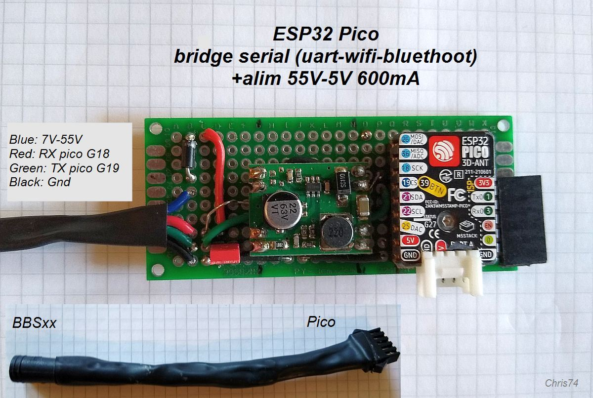

# BBS_config

<p align="left">
  
</p>

Arduino/ESP library to facilitate the configuration of a Bafang BBSxx electric bike, including several complete examples.
As a bonus you will also find spreadsheet for generating or verifying complete BBSxx frames. :wink:  

Note: It is advisable to learn a little about Bafang BBS, for example on electric bike forums.  
In the "BbsSetting.h" configuration file, the names used in the comments are the same as in Penoff's software: [Penoff BBS-tool](https://penoff.me/tag/bafang/)

## How to use the library
Download the source, unzip and install in your Arduino library folder.

### header 

```
#define USE_ESP32 1  // Choose: 1=ESP32, 0=Arduino Uno/Nano

#if USE_ESP32
    #include <HardwareSerial.h> 
#else
    #include <SoftwareSerial.h> // Arduino Uno/Nano   
#endif

// -- library for config Bafang BBSxx
#include <BBS_config.h> 

// -- objet BBS_config
BBS_config bbs; 

// All your settings for your Bafang BBSxx (this file must be in the same folder as this sketch)
#include "BbsSetting.h" 

// --- GPIO and init Serial object (SerialBbs) ---- 
#if USE_ESP32
    // ESP32
    const int RX2_PIN    = 16;  // RX Serial2 (16 default esp32)
    const int TX2_PIN    = 17;  // TX Serial2 (17 default esp32)
    HardwareSerial SerialBbs(2);      
#else
    // Arduino
    const int RX2_PIN    = 10;  // SoftwareSerial RX 
    const int TX2_PIN    = 11;  // SoftwareSerial TX
    SoftwareSerial SerialBbs(RX2_PIN, TX2_PIN); 
#endif

 
```

### setup
```
    // -- Serial console (USB) if debug
    Serial.begin(115200);
    
    // -- Serial2 BBS (BBSxx = 1200 Bd !)
    #if USE_ESP32
        SerialBbs.begin(1200, SERIAL_8N1, RX2_PIN, TX2_PIN);
    #else
        SerialBbs.begin(1200);
    #endif
    
    bbs.begin(SerialBbs); //  begin BBS object, serial2
```
and still in the setup, generate buffer for the three parts of the configuration contained in the BbsSetting.h file

```
if (bbs.generateBasic(B_LEVEL, B_LB, B_CL, B_WD)) Serial.println("generate Basic OK");

if (bbs.generatePas(P_DA, P_SL, P_SC, P_SSM, P_SDEG, P_WA, P_TS, P_CD, P_SD, P_KC)) Serial.println("generate PAS OK");  

if (bbs.generateThrottle(T_SV, T_EV, T_type, T_DL, T_SL, T_SC)) Serial.println("generate Throttle OK");
    
```

in the loop or functions, you can use :
```
        void readBasic();
        void readPas();
        void readThrottle();
        
        bool writeBasic();
        bool writePas();
        bool writeThrottle();
```
To go further, see the complete examples

## Examples 
:file_folder: (more images and documents see the /docs folder)

### Simple sketch with Led and button (Arduino/Esp)
Minimum version: Modify or check your configuration file "BbsSetting.h" A short press of the button will transmit the new settings to your controller. If successful, the led will flash several times quickly!  
If fails, the LED will not flash.  
- [BBS_button_cmd](./examples)

<p align="left">
  
  
</p>

### WebSerial (Esp only)
Examples with webserial console and OTA Wifi.   
Allows you to configure and check completely remotely by wifi!  
Note: it is possible to use this circuit for other serial applications. For example, I also use mine to set up a Xiaoxiang Smart BMS by PC Bluethoot :wink:
- [BBS_webserial_cmd](./examples)

<p align="left">
  
</p>
<p align="left">
  
</p>
<p align="left">
  
</p>

## Bonus
Spreadsheet for generating or verifying complete BBSxx frames. There is also a lot of information about the BBS protocols used ! 
- [reprogram BBS converter.xls](./docs/Excel)

<p align="left">
  
</p>

Long live BBSxx! :blush:


